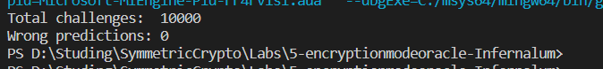

Перебор BLOCK_SIZE + 1 вариантов:
```cpp 
    for (size_t i = 0; i < BLOCK_SIZE + 1; ++i) {
        string block{ctext.begin() + i, ctext.begin() + i + BLOCK_SIZE};
        if (ctext.find(block, i + BLOCK_SIZE) != string::npos) return ECB;
    }
```
Note: В данном случае сработало, но только из-за того, что судя по всему больше, чем один блок, в начало не генерится. В общем случае мы же можем и не знать, где конкретно наш текст, поэтому возможно правильней искать все блоки, а не только первые 2. 
```cpp 
for (size_t i = 0; i < ctext.size() - 2 * BLOCK_SIZE; ++i)
```
Вероятность тогда получить идентичные блоки при CBC режиме все равно явно < e.
Note x2: Даже если используется AES с ключом 192/256 бит, увеличение BLOCK_SIZE ничего не ломает, т.к. и размер нужных блоков ОТ также увеличивается.

