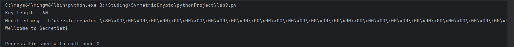

*Реализация хэш-функции и атаки пренадлежит Mantej Singh Rajpal: https://github.com/mantej/cryptopals/blob/master/python/set4/4-29.py* 

## Суть атаки в общих словах
Используется атака удлинением сообщения (length extension). Так как sha1 является итеративной конструкцией, т.е. на каждом шагу вычисляются значения, которые являются входными данными для следующего шага, то зная значение хэша на каком-то конкретном шаге, можно использовать его как инициализирующее значение для последующего шага (очень напоминает по своей сути префиксную атаку). 

## Для SHA1
Исходные данные, которые нам нужно знать: а никаких :) Кроме того, что функция MAC на другой стороне это SHA1(k || m). И с учетом того, что мы знаем, как работает SHA1, легко построить новое сообщение на основе знания MAC(m), а именно: m’ = m || padding || new_m
Что будет происходить при вычислении хэша на стороне сервера:
-	К m’ приписывается ключ k, т.е. на вход SHA1 подается уже k || m || padding || new_m
Заметим, что {k || m || padding} и есть наше исходное MAC(m). Таким образом, по сути единственное, что нам нужно угадать, это длину {k || m}, чтобы дополнить 512-битный блок паддингом нужной длины и нужным значением длины исходного сообщения по алгоритму sha1 (Ибо понятно, что если сразу же начать добавлять туда новые данные без дополнения, то обрабатываемый хэш-функцией блок на первой итерации обработки будет уже отличаться от хэша от k || m). 
-	Обрабатывается первый 512-битный блок сообщения, вычисляются A, B, C, D, E, общность которых, как ни удивительно, является полным маком от исходного сообщения. Далее так же итеративно вычисляется значения A, B, C, D, E для последующих блоков длины 512 бит, которые являются являются суммой (по модулю 2^32) значений A, B, C, D, E с предыдущей итерации соответственно, и новых, которые вычисляются для текущего блока.

Таким образом, единственное, что нам нужно знать, это |k || m|, чтобы подобрать дополнение. И т.к. по условию лабы нам уже дано исходное сообщение, вполне возможно реализовать брутфорс атаку по перебору только длины ключа (длина сообщения есть). Т.к. если бы сообщения не было, то на такой перебор понадобилось бы явно больше запросов-ответов (имеющийся мак может быть и от сообщения длины 10Кбит, к примеру).  
Далее необходимо вычислить мак от сообщения new_m, **установив инициализирующие значения A, B, C, D, E вместо дефолтных на соответствующие значения из имеющегося мака**.

## Комментарии к исходному коду атаки
Реализованная Раджпалом функция sha1 это скорректированный код одной из реализаций хэш-функции со stackexchange – добавлены передача параметров инициализирующих [A, B, C, D, E] и длина результирующего сообщения для дополнения. Таким образом можно будет передать в хэш-функцию результат мака исходного сообщения с учетом того, что это именно добавочный текст к уже существующему.
Главный цикл реализует перебор длин ключа, чтобы добавить корректный по длине паддинг. Соответственно, вычисление нового корректного мака происходит в forge_message.
Функция glue_padding формирует битовое представление результирующего сообщения (m || pad || new_pad; ключ заполняется просто какими-то байтами, в данном случае символом ‘A’, и нужен только для удобства вычисления дополнения), дополняет блок до 448 бит последовательностью [100…0], после чего записывает 8-байтовое значение длины **конкретно исходного сообщения** (т.к. именно для этого сообщения у нас есть значение мака, и необходимо, чтобы на стороне сервера значение блока с исходным сообщением вычислялось так же, как если бы это было сообщение без дополнения).
*Note:* если суммарная длина ключа и исх. сообщения превысит 448 + 512 * n бит, ничего все равно не сломается; код также корректно дополнит новый 512-битный блок до 448 бит нулями:
```python 
while len(pBits) % 512 != 448:
        pBits += "0"
```
После этого автор удаляет ключ (длина которого заполнена символами ‘A’), переводит сообщение в hex, и разделяет посредством функции get_internal_state известный мак исходного сообщения на A, B, C, D, E, которые мы передадим в качестве инициализирующих значений в sha1 (с учетом полной длины сообщения, вместе с длиной ключа, исходного сообщения и добавленного паддинга для k || m):
```python 
forged_digest = sha1(new_message, h[0], h[1], h[2], h[3], h[4], (keylen + len(forged_message)) * 8)
```
Так будет продолжаться до тех пор, пока длина ключа + длина исходного сообщения не совпадет с оригинальной, что даст нам корректный мак для сообщения { m || pad || new_m }, который мы отправляем вместе с этим сообщением, где дальше на стороне сервера выполняется все то же, что описано в начале.
